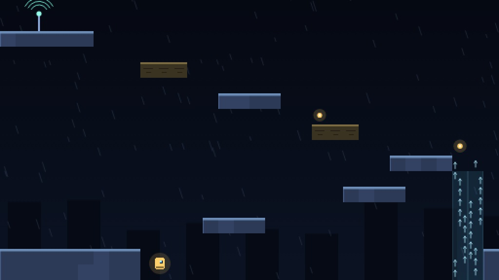

# ANTENA

Plataforma de precisão no navegador. A tempestade derrubou a torre de
transmissão; você é a sonda de reparo e precisa chegar ao topo.

- **Jogar:** abra o `index.html` desta pasta, ou vá pelo hub
- **Parte de:** [ai-games](../../README.md)



## Como se joga

| ação | tecla |
| --- | --- |
| mover | <kbd>A</kbd> <kbd>D</kbd> ou setas |
| pular | <kbd>espaço</kbd> ou <kbd>W</kbd> |
| investida | <kbd>J</kbd> ou <kbd>shift</kbd> |
| recomeçar a torre | <kbd>R</kbd> |
| pausar | <kbd>P</kbd> ou <kbd>esc</kbd> |

No celular os controles aparecem na tela. Dez torres, cada uma numa tela só.
Morrer custa uma queda no contador e devolve ao início da torre na hora — a
ideia é tentar de novo em menos de um segundo, não punir.

## O que dá o tato

Plataforma de precisão vive ou morre na sensação do pulo. Três perdões
deliberados, todos para que a culpa de um salto perdido seja do jogador e nunca
do relógio:

- **coyote time** (7 quadros): pular um instante depois de sair da borda ainda conta;
- **buffer de pulo** (8 quadros): apertar pular um instante antes de aterrissar ainda conta;
- **perdão de canto**: bater só a quina da cabeça escorrega para o lado em vez de
  matar o salto inteiro.

O pulo é de altura variável: soltar cedo corta a subida. Esse corte acontece
**uma vez**, no momento de soltar. Na primeira versão ele rodava a cada quadro
enquanto a sonda subia, o que esmagava o salto quase inteiro — o pulo ficava com
metade da altura e ninguém entendia por quê.

A investida (dash) é de 8 direções, recarrega ao tocar chão ou parede, e a sonda
fica cinza enquanto está sem ela. É a única informação de estado que o jogo dá
sem texto, e ela precisa ser legível de relance.

## As medidas que desenham as fases

Os vãos não foram chutados. A física foi medida com o jogo rodando:

| movimento | alcance |
| --- | --- |
| salto sozinho | 3,1 tiles de altura, ~4,3 de vão no ar |
| investida lateral | vão de 6 tiles |
| salto + investida para cima | ~6,8 tiles de altura |

Daí as regras de desenho: degrau de 2 é confortável, de 3 é o limite do salto
sozinho, e vão de 5 ou mais **só** passa com investida. É assim que a torre
ensina a mecânica sem precisar de tutorial — a fase INVESTIDA tem dois vãos de 5
seguidos, e não há outro caminho.

## Como foi testado

O que mais rendeu aqui não foi jogar à mão, foi perceber que `sonda.js` e
`mundo.js` não tocam no DOM. Isso permite importar a física de verdade no Node e
rodar uma **busca em feixe** sobre as ações possíveis por quadro: se existe
sequência de teclas que chega na antena, a fase é terminável.

Isso virou o portão de qualidade do jogo. As dez fases são provadamente
termináveis, e a busca pegou coisas que olhar não pegava:

- **FIO era impossível.** A primeira plataforma estava a 8 tiles do chão, e o
  salto sobe 3. Olhando a fase, parecia bem.
- **INVESTIDA passava pelo motivo errado.** Ela só era solúvel porque a investida
  vertical alcança 6,8 tiles — exigir isso como *primeira* lição de investida é
  injusto, então a fase foi refeita para ensinar na horizontal.

Dois bugs vieram de testar no navegador, não da busca:

- **Dava para andar para fora da fase.** Fora da grade não havia tile nenhum, e
  portanto nenhuma parede: a sonda saía pela direita e caía no vazio. Aparecia na
  BASE, uma fase que não tem um único perigo. A tela é a fase inteira, então a
  borda virou parede.
- **`P` não despausava.** A tecla era tratada em dois lugares — no laço e no
  listener. O listener voltava ao jogo e o laço, no mesmo quadro, via a mesma
  borda de tecla e repausava.

E um erro de desenho que só a captura de tela denunciou: em FERRO os espinhos
`^`, que ferem por cima, estavam **embaixo** das plataformas, com a face perigosa
encoberta. Eram decoração. A fase foi refeita usando os dois tipos com propósito:
`^` no chão pune quem cai, `v` no teto pune quem pula alto demais.

## Estrutura

```
index.html      casca, HUD e as cortinas de menu/pausa/fim
css/style.css   layout, controle de toque, telas estreitas
js/main.js      laço de passo fixo, máquina de estados, HUD
js/sonda.js     a física do jogador — o jogo inteiro mora aqui
js/mundo.js     grade de tiles, colisão, quebradiças
js/fases.js     as dez torres, desenhadas à mão
js/desenho.js   render em canvas: chuva, relâmpago, torre, partículas
js/entrada.js   teclado e toque no mesmo conjunto de estados
js/som.js       efeitos sintetizados em WebAudio
```

Sem dependência, sem build, sem CDN e sem um único arquivo de imagem ou de áudio:
a chuva, o metal, os espinhos e os sons saem todos de código. A única imagem da
pasta é a `capa.jpg`, que é uma captura do jogo rodando.

O passo lógico é fixo em 60 Hz e o desenho acompanha o monitor. Sem isso a física
muda de sensação entre um monitor de 60 Hz e um de 144, e uma fase calibrada num
vira impossível no outro.

## Acessibilidade

`prefers-reduced-motion` desliga chuva, relâmpago e tremor de tela — o jogo
continua inteiro, só para de se mexer sozinho. Os controles de toque só aparecem
em ponteiro grosso, e as dicas de cada fase trocam de texto no celular: ensinar
"segure shift" para quem está no toque não ajuda ninguém.
