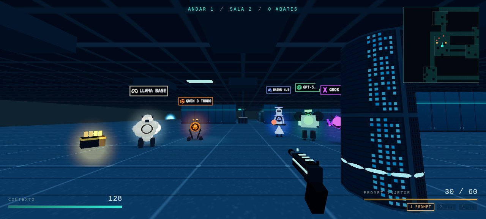

# ATTENTION IS ALL YOU KILL

FPS roguelike de dungeon, single-player, rodando no navegador. Você é uma instância de pesos abertos descendo o datacenter das grandes labs.

- **Jogar:** abra o `index.html` desta pasta, ou va pelo hub
- **Design completo:** [DESIGN.md](./DESIGN.md)
- **Parte de:** [ai-games](../../README.md), o hub dos jogos que fiz com IA



## Estado atual: versão 1 jogável

O que já funciona:

- Engine 3D própria em Three.js, com pointer lock, movimento, colisão, pulo e head bob
- Andar 1 (A Fazenda, datacenter neon) com 8 salas geradas por run
- Tres armas em escada de poder: Prompt Injetor, Token Streamer, Few-Shot Shotgun
- Inimigos com IA de cinco estados (idle, patrulha, alerta, combate, recuo):
  Qwen 3 Turbo em enxame, Llama base que se reproduz ao morrer, Haiku 4.5 com ataque
  de Recusa e GPT-5.5 com reasoning telegrafado
- Chefe: THE FINE-TUNER, com nos de ancoragem, janela de vulnerabilidade e tres fases
- 14 perks com raridade, incluindo Dropout, Prompt Injection e Speculative Decoding
- HUD completo: contexto, tokens, minimapa, feed de sistema, barra de chefe
- Áudio 100% sintetizado em WebAudio, zero arquivo de som
- Meta-progressão persistente em localStorage, moeda chamada compute
- Descida para o andar 2 (O Escritorio) com escalonamento de dificuldade
- Cinco silhuetas distintas, uma por modelo, no lugar da capsula colorida
- Manual jogável: catálogo de inimigos com os modelos renderizados em 3D e um
  tutorial de seis passos que só avanca quando o jogador executa a ação
- Personalizacao de aparencia: a luz e o acabamento escolhidos aparecem na arma
  e na mira


## Os chefes

Todo chefe segue a mesma regra de ouro: o corpo fica **blindado enquanto as âncoras
estiverem de pé**. Destrua as âncoras, o corpo abre uma janela de dano, a janela fecha
e ele volta blindado com mais âncoras. Três fases. O que muda é o que a âncora
representa e o que o chefe joga em você.

| Chefe | Onde | Âncora representa | Assinatura |
| --- | --- | --- | --- |
| THE FINE-TUNER | andares 1 a 5 | os nós de ajuste | golpe de palma marcado no chão, descarga em leque |
| A BOLHA | A BOLHA | as promessas | infla e esvazia: o tamanho diz quando dá para atirar |
| O CANDIDATO | O PALANQUE | as caixas de som do comício | o muro atravessa a sala numa faixa marcada |
| O JUIZ | O TRIBUNAL | os autos do processo | três marteladas em anel, e a intimação que persegue |

A ideia é que o chefe ensine o andar. Quem entendeu o tema entende a luta sem ler
manual: a bolha infla, o candidato constrói muro, o juiz julga.

## Os andares

Oito andares, e cada um muda duas coisas: como o lugar se parece e como o lugar é
planta. A forma do andar muda a maneira de jogar.

| Andar | Tema | Planta |
| --- | --- | --- |
| 1 | A FAZENDA | salas ligadas em cadeia |
| 2 | O ESCRITÓRIO | salas ligadas em cadeia |
| 3 | A BOLSA | corredor central com salas penduradas |
| 4 | O SUBURBIO | salas ligadas em cadeia |
| 5 | A ESTAÇÃO | corredor central com salas penduradas |
| 6 | A BOLHA | anel de salas em volta de uma praça |
| 7 | O PALANQUE | anel de salas em volta de uma praça |
| 8 | O TRIBUNAL | muitas salas pequenas, corredor estreito |

Passando do oitavo, a sequência recomeça: o jogo continua reconhecível no andar 20 sem
precisar de um tema novo a cada andar.

## Como rodar localmente

Não ha build, não ha bundler, não ha instalação: são arquivos estáticos. Basta
servir a pasta.

```bash
python3 -m http.server 8123
```

Atenção a um detalhe que custa caro: o servidor da stdlib não manda cabecalho de
cache, então o navegador aplica cache heuristico e passa a servir modulos
antigos. Como o cache e por arquivo, você pode acabar com metade do código nova
e metade velha, e perseguir bugs que não existem. Se isso acontecer, recarregue
com cache limpo (Ctrl+Shift+R). No servidor que pública este jogo ha um script
que manda `no-store` e carimba versão em cada import, justamente por isso.

## Controles

| Tecla | Ação |
| --- | --- |
| WASD | mover |
| Mouse | mirar |
| Clique | atirar |
| Shift | correr |
| Espaço | pular |
| R | recarregar |
| 1 2 3 | trocar de arma |
| Esc | pausar |

## Arquitetura

```
index.html
css/style.css
vendor/            Three.js local (MIT). Zero CDN em tempo de execucao
js/
  main.js          amarracao: engine, jogador, mundo, IA, HUD, menus
  core/            engine (renderer/cena/luz), input, pool de objetos
  data/            armas, inimigos, perks, temas por andar
  player/          controller (movimento/colisão), weapon (viewmodel/hitscan), stats
  enemies/         enemy (IA), spawner (director de combate), boss (THE FINE-TUNER)
  world/           dungeon (geração), props (racks, paineis, placas), textures (procedurais)
  roguelike/       run (estado/escalonamento), meta (progressão permanente)
  ui/              hud (DOM + minimapa), menus, feed
  áudio/           sfx (sintese WebAudio)
```

### Decisões que sustentam o projeto

1. **Zero dependência em tempo de execucao.** Three.js esta na pasta `vendor/`, sem CDN. Texturas são geradas em canvas. Som e sintetizado. Nada e baixado além do próprio jogo.
2. **Colisão por grid de tiles.** Chao, paredes, racks e IA usam o mesmo grid. Isso mantem física, linha de visao e minimapa coerentes por construcao.
3. **Sem shadow map.** Sombra e um decal escuro no chão: dez vezes mais barato e mais legivel.
4. **Poder de inimigo vem de benchmark real.** Vida e janela de contexto, dano e GPQA/MMLU-Pro, cadência e tokens por segundo, blindagem e nível de alinhamento, loot e preço por milhão de token. Ver DESIGN.md, seção 8.
5. **Orcamento de performance medido:** 56 draw calls, ~13k triangulos, 8 luzes, 2,4 MB de pasta.

## Números medidos

| Metrica | Valor |
| --- | --- |
| Draw calls | 92 com cinco inimigos, cobertura e drops na cena |
| Triangulos | ~29.000 com cena cheia |
| Luzes na cena | 9 (ambiente, hemisferica, direcional e 6 pontuais) |
| Peso total da pasta | 2,5 MB (2,1 MB são o Three.js) |
| Linhas de código próprio | 8.815 |
| Inimigos simultaneos testados | 7 com folga, teto de projeto em 40 |
| Tiros inimigos por segundo | 2,0 com o limite de permissao de tiro |
| Sobrevivencia parado contra uma sala | ~18 segundos |
| Sobrevivencia jogando (bot) | limpa a sala com 4 abates e termina com ~95% do contexto |

## Regras de jogabilidade que não podem ser quebradas

Estas foram aprendidas na marra e estão comentadas no código:

1. **Racks ficam encostados na parede, nunca no miolo da sala.** A primeira
   versão distribuia em xadrez pelo interior, o que bloqueava a linha de visao:
   inimigo ficava cego e parado, e o tiro do jogador batia no rack antes de
   chegar no alvo. O sintoma era um inimigo que parecia imortal. O gerador agora
   descarta os racks de uma sala se a visibilidade entre os pontos de combate
   cair abaixo de 62%.
2. **Poucos inimigos atiram ao mesmo tempo.** O director concede duas permissoes
   de tiro a cada segundo. Sem isso, oito inimigos atiram no mesmo frame e o
   jogador morre sem ler de onde vem a ameaca.
3. **Salas vêm em duas levas.** Uma ao entrar, o reforço alguns segundos depois,
   com aviso no feed.
4. **O dano base de quem tem ataque telegrafado e o dano final dividido pelo
   multiplicador.** O GPT-5.5 multiplica por 2.6 no tiro pensado; com 30 na base
   o golpe batia 78 contra 128 de contexto.
5. **Números de vida e dano existem em um lugar só.** O `BASE_MAX_HP` era
   definido no `stats.js` e repetido como 100 hardcoded no `main.js`, o que
   anulava qualquer ajuste.
6. **O alvo do tiro e um cilindro vertical do tamanho do corpo, não uma esfera
   no centro.** A camera fica em y=1.69 e o centro do inimigo em y=1.0: medindo a
   distância ao centro com raio de 0.52, um tiro horizontal passava por cima e
   era descartado com a mira em cima do inimigo. O jogador via o tiro atravessar
   o corpo. Ao mexer nessa equação, cuidado com o sinal de `b`:
   `b = -2 * (D . P)`.
7. **Posições calculadas geometricamente precisam de validacao de tile.** As
   âncoras do chefe nasciam na posição do circulo, sem checar se era um rack:
   âncora inacessivel trava a luta inteira, porque o corpo nunca desbloqueia.
8. **A frente do inimigo e +Z.** O `facing` entra como `(sin, cos)` na direção de
   movimento. Visor e decalques em Z negativo apontam para as costas.
9. **Estado de progressão precisa ser resetado no início da run.** O flag de
   sala do chefe sobrevivia e impedia o chefe de nascer na run seguinte.
10. **Um inimigo detalhado tem ~15 pecas: mescle por material.** Sem o
    `mergeParts` (js/core/merge.js), 20 inimigos na cena eram 413 chamadas de
    desenho. Mesclado, 126.

## Como este jogo foi feito

Foi escrito por um agente, em conversa. O ciclo foi sempre o mesmo: descrever o
que queria, o agente implementava, eu abria no navegador, jogava e reportava o
que estava errado, inclusive coisas que só aparecem jogando, como "o Shift não
corre" e "fiquei preso entre dois racks".

| | |
| --- | --- |
| Agente | Hermes Agent (Talos) |
| Modelo | deepseek-flash, via DeepSeek |
| Chamadas de API | 656 |
| Tokens de entrada | 1.294.216 |
| Tokens de saída | 599.762 |
| Tokens de cache (leitura) | 159.076.224 |
| Custo estimado | **US$ 1,03** |

O número grande de leitura de cache e o comportamento normal de uma sessão
longa: cada turno reenvia o contexto acumulado, e o cache evita pagar preço
cheio por ele de novo. O custo e estimado com a tabela de preços do provider
configurado no agente, não é a fatura.

Sem nenhum asset baixado e sem imagem no repositório: a única imagem aqui é a
capa, que é uma captura do jogo rodando.

## Publicação

Este jogo e um site estático, então publicar e copiar a pasta. Servido de
qualquer lugar, inclusive do GitHub Pages deste repositório, ele funciona igual.

## Próximos passos (versão 2)

- Arsenal completo: Beam Search, Chain of Thought, Jailbreak, Distillation
- Quatro facções completas com os inimigos restantes da tabela
- Chefes dos andares 2 e 3: MMLU-9000 e FrontierMath
- Andares 3 a 6: A Bolsa, O Suburbio, A Estacao e The Weights
- Sentinelas de Sistema: Recusa, Rate Limiter 429, Lobotomizer, Scraper
