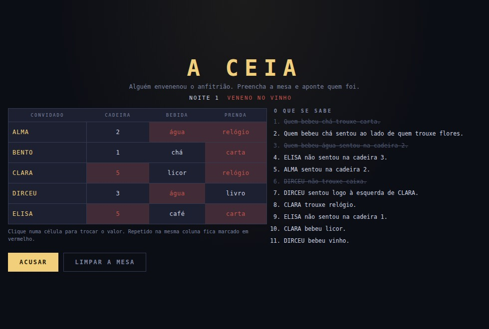

# A CEIA

Jogo de dedução lógica. Cinco convidados, uma ceia, um veneno. Cada convidado
sentou numa cadeira, bebeu uma coisa e trouxe uma prenda — descubra quem é quem e
aponte o culpado.

- **Jogar:** abra o `index.html` desta pasta, ou vá pelo hub
- **Parte de:** [ai-games](../../README.md)



## Como se joga

Clique numa célula da mesa para trocar o valor; botão direito volta. Valor
repetido na mesma coluna fica marcado em vermelho — é erro de regra, e o jogo
mostra na hora.

As pistas à direita podem ser **riscadas com um clique**. Isso é caderno, não
regra: não muda nada no jogo, só ajuda a não reler a mesma coisa dez vezes.

Com a mesa inteira preenchida, **ACUSAR**. O veneno estava no cálice de quem
bebeu determinada bebida (o jogo diz qual), então resolver a mesa é o que aponta
o culpado — a acusação é consequência da dedução, não um chute à parte.

Errou? O jogo diz **em qual coluna** ainda há erro e quantas células, nunca
quais. Apontar a célula exata entregaria o enigma em duas tentativas.

## A garantia que este jogo dá

Um enigma de dedução só é justo se tiver **uma** solução e se **toda pista for
necessária**. Nenhuma das duas coisas dá para conferir no olho. Então o gerador
não entrega enigma nenhum sem antes:

1. **resolver por força bruta** e exigir exatamente uma solução;
2. **tirar cada pista, uma por vez**, e exigir que sem ela apareça mais de uma.

A segunda é a que mantém o enigma limpo. Pista que dá para remover sem perder a
unicidade é pista que o jogador lê, gasta tempo e não usa — e uma lista dessas é
o que faz jogo de dedução parecer trabalhoso em vez de engenhoso.

Quarenta enigmas gerados e provados no teste: **todos com solução única, nenhum
com pista sobrando.** De 11 a 13 pistas cada.

### Como a força bruta cabe no orçamento

São três permutações de cinco elementos: 120³ ≈ 1,7 milhão de combinações por
enigma. E a checagem de minimalidade roda o solucionador **uma vez por pista**,
umas doze vezes por enigma.

O que torna isso viável é podar por categoria. As pistas que só olham cadeira
filtram as 120 permutações de cadeira antes de a bebida entrar; as que cruzam
cadeira e bebida filtram antes de a prenda entrar. Na prática sobra uma fração
das combinações, e um enigma sai em poucos milissegundos.

## Tipos de pista

| tipo | exemplo |
| --- | --- |
| direta | "BENTO trouxe caixa." |
| negativa | "CLARA não bebeu vinho." |
| vizinhança | "ALMA sentou logo à esquerda de BENTO." |
| ordem | "DIRCEU sentou em alguma cadeira antes de ELISA." |
| cruzada | "Quem bebeu licor trouxe livro." |
| cruzada dupla | "Quem bebeu água sentou ao lado de quem trouxe caixa." |

O gerador junta pistas ao acaso até a solução ficar única, e só depois poda o que
sobra. Por isso a mistura de tipos muda de noite para noite.

## Estrutura

```
index.html      a mesa e as pistas
css/style.css   layout, telas estreitas
js/main.js      liga o enigma ao DOM — a única parte que conhece o navegador
js/enigma.js    gerador, solucionador e conferidor, sem DOM
js/som.js       efeitos sintetizados em WebAudio
```

`js/enigma.js` não tem uma linha de DOM, e é isso que permite provar a unicidade
dos enigmas fora do navegador.

Sem dependência, sem build, sem CDN e sem um único arquivo de imagem ou de áudio.
A única imagem da pasta é a `capa.jpg`, captura do jogo rodando.

## Um bug que o teste pegou

O aviso de erro saía como "tente de novo" em vez de apontar a coluna. A causa era
ordem de chamada: eu escrevia a mensagem e **depois** chamava a função que
repinta a mesa, que limpa esse mesmo campo. A mensagem útil era destruída meio
milissegundo depois de existir.
