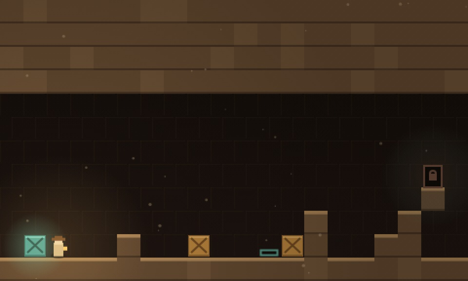

# CRIPTA

Puzzle de empurrar caixa com gravidade, num túmulo soterrado. Oito salas.
Todas têm solução — isso foi **provado**, não prometido.

- **Jogar:** abra o `index.html` desta pasta, ou vá pelo hub
- **Parte de:** [ai-games](../../README.md)



## Como se joga

| ação | tecla |
| --- | --- |
| andar | <kbd>&larr;</kbd> <kbd>&rarr;</kbd> ou <kbd>A</kbd> <kbd>D</kbd> |
| subir na caixa | <kbd>&uarr;</kbd> + direção |
| desfazer | <kbd>Z</kbd> |
| recomeçar a sala | <kbd>R</kbd> |

No celular os controles aparecem na tela, e o botão <kbd>&uarr;</kbd> alterna o
modo subir em vez de precisar ser segurado.

## As três regras

1. **A caixa só é empurrada, nunca puxada.** Caixa empurrada demais para a
   esquerda é caixa perdida.
2. **Você sobe um degrau sozinha.** Se a caixa não tem para onde ir, ela vira
   degrau — segure <kbd>&uarr;</kbd> para subir nela mesmo quando ela poderia ser
   empurrada.
3. **A gravidade vale para todo mundo.** Caixa sem chão cai; você também.

A porta só destranca com todas as placas ocupadas.

**Desfazer não é enfeite aqui.** Num jogo de empurrar caixa, um erro a três
jogadas de distância obrigaria a refazer a sala inteira — e a pessoa fecha a aba
em vez de recomeçar. O histórico inteiro fica guardado.

## Como foi testado

Puzzle por turnos tem espaço de estados pequeno e discreto, e o módulo de regras
não toca no DOM. Isso permite duas coisas que, juntas, dão uma garantia forte:

1. **Busca em largura no Node prova solubilidade** e ainda devolve o *mínimo* de
   jogadas — o número que diz se a sala tem miolo ou se é só uma caminhada.
2. **As soluções encontradas são reproduzidas no navegador**, no jogo de verdade.
   Como é por turnos, não há tempo envolvido: se a sala fecha no teste, ela fecha
   para quem jogar.

A busca não foi cerimônia: na primeira rodada, **as dez salas eram insolúveis**.
Ela expôs um erro de regra que nenhuma quantidade de olhar teria pego.

### O erro que derrubou tudo

Não dava para **subir em cima de uma caixa**. O teste de bloqueio só olhava
pedra, então uma caixa nunca disparava a escalada — ela só podia ser empurrada.
Sem caixa virando degrau, não existe Sokoban com gravidade, e nenhuma sala
fechava.

E o desenho estava com a geometria invertida: eu tinha posto os degraus *acima
da cabeça* em vez de na linha em que a jogadora anda. Bloco acima da cabeça não é
degrau — é passar por baixo dele.

### O modificador de subir

Corrigir a primeira regra revelou a segunda: com "empurra se der, senão sobe",
não existe como passar por cima de uma caixa **empurrável**. Isso trava o jogo no
instante em que uma caixa fica parada numa placa: o único jeito de seguir seria
empurrá-la para fora da placa. Daí o <kbd>&uarr;</kbd>.

### Depois disso, duas salas ainda não fechavam

- **TORRE:** a primeira caixa ficava presa atrás de uma parede, e a segunda era
  necessária em dois lugares ao mesmo tempo.
- **FUNDO:** a placa estava do lado errado de uma parede que a caixa não
  atravessa, e uma parede de duas linhas de altura sobrou sem caixa para vencê-la.

### E um erro de legibilidade que só a captura mostrou

A luz do lampião escurecia as bordas até 74% e escondia metade do tabuleiro. Num
jogo de ação isso é clima; num jogo de **puzzle** é sabotagem — quem planeja
precisa ver a sala inteira. A vinheta caiu para 26% e a pedra clareou.

## O mínimo de jogadas de cada sala

| sala | mínimo | estados explorados |
| --- | --- | --- |
| DEGRAU | 16 | 70 |
| CAIXA | 16 | 540 |
| ESCADA | 16 | 300 |
| PLACA | 16 | 766 |
| DUPLA | 16 | 1846 |
| BEIRA | 26 | 1218 |
| TORRE | 16 | 282 |
| FUNDO | 20 | 1990 |

A coluna de estados é o tamanho real do espaço de busca de cada sala, e é uma
medida honesta de quanto ela faz pensar.

## Estrutura

```
index.html      casca, HUD e as cortinas
css/style.css   layout, controle de toque, telas estreitas
js/main.js      telas, teclado, toque, laço de animação
js/estado.js    as regras e o desfazer — o jogo inteiro mora aqui
js/nivel.js     as oito salas, desenhadas à mão
js/desenho.js   render em canvas: pedra, madeira, lampião, poeira
js/som.js       efeitos sintetizados em WebAudio
```

Sem dependência, sem build, sem CDN e sem um único arquivo de imagem ou de áudio.
A única imagem da pasta é a `capa.jpg`, que é uma captura do jogo rodando.

## Acessibilidade

`prefers-reduced-motion` desliga a poeira. Cada jogada tem som próprio, e "não
deu" soa diferente de "deu" — sem isso a pessoa não sabe se o comando entrou.
