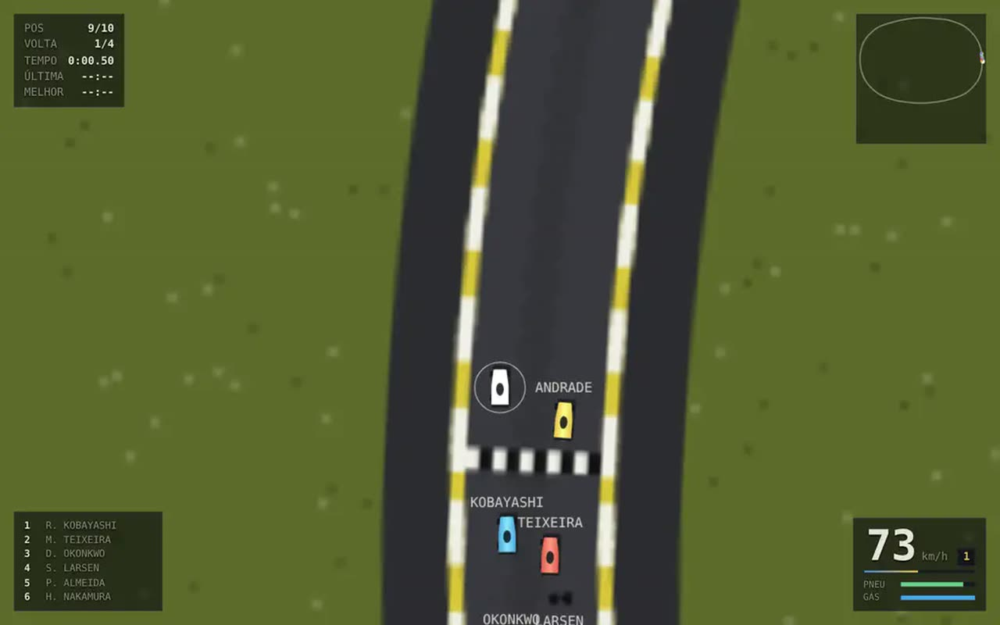

# CURVA

Kart em três dimensões, no navegador, com WebGL2 escrito à mão: sem biblioteca,
sem arquivo de modelo, sem textura em disco. Seis kartódromos com relevo, nove
adversários, itens — e uma técnica que decide a corrida.

- **[Jogar](https://luccapinto.github.io/ai-games/games/curva/)** ou abra
  `index.html` desta pasta servido por HTTP (ver [Rodar](#rodar))
- **Parte de:** [ai-games](../../README.md)



## A decisão do jogo

O kart tem dois modos, e a diferença entre eles é um número: **o teto de
velocidade de giro**.

| | teto de giro | g lateral sustentado | deriva |
| --- | --- | --- | --- |
| aderência | 65% do que o pneu daria | 0,84 g | até 0,11 rad |
| de lado (`shift`) | 240% | 0,93 g | até 0,24 rad |

Em aderência o kart é macio e sai largo: **grampo de 10 a 14 m ele não faz**. De
lado ele gira 2,4 vezes mais rápido do que a aderência permitiria, e a
derrapagem carrega o **mini-turbo** em três faixas (0,3 s, 0,7 s e 1,2 s de
gatilho segurado). Soltar o gatilho entrega o empurrão.

Derrapar não é enfeite, e isso é medido pelas provas:

| pista | volta de lado | volta de frente | ganho | grampo isolado |
| --- | --- | --- | --- | --- |
| BAIXADA | 45,67 s | 50,42 s | **4,75 s** | +0,87 s |
| CANAVIAL | 51,70 s | 54,65 s | **2,95 s** | +0,75 s |
| SERRA | 39,88 s | 42,17 s | **2,28 s** | +0,50 s |
| PORTO | 32,32 s | 38,60 s | **6,28 s** | +1,50 s |
| CERRADO | 47,85 s | 48,85 s | **1,00 s** | +0,73 s |
| VIADUTO | 38,37 s | 41,90 s | **3,53 s** | +1,00 s |

A comparação é feita com a **linha de corrida de cada modo**: quem não derrapa
tem outro traçado e outro perfil de velocidade, calculados com o teto de giro da
aderência. Com as duas corridas na mesma linha, a medida dizia que derrapar
atrasa — e dizia isso porque o kart sem drift ganhava tempo cortando zebra numa
linha que não era a dele.

O CERRADO (curvas de 30 a 45 m) é a pista onde a técnica menos vale, e isso é
balanceamento: se derrapar rendesse o mesmo em toda pista, escolher pista não
decidiria nada.

## Jogar

| ação | tecla |
| --- | --- |
| acelerar / frear | <kbd>W</kbd> <kbd>S</kbd> ou <kbd>↑</kbd> <kbd>↓</kbd> |
| virar | <kbd>A</kbd> <kbd>D</kbd> ou <kbd>←</kbd> <kbd>→</kbd> |
| derrapar | <kbd>shift</kbd> — segure na curva, solte na saída |
| usar item | <kbd>espaço</kbd> |
| câmera | <kbd>C</kbd> (perseguição ou capacete) |
| pausar / reiniciar | <kbd>esc</kbd> <kbd>R</kbd> |

No celular os controles aparecem na tela. Seis etapas de campeonato com a
pontuação 25-18-15-12-10-8-6-4-2-1.

## As seis pistas

Escritas como um projetista escreve: sequência de retas e curvas, cada curva com
raio e ângulo em graus.

| pista | tema | volta | curvas | raio menor | reta maior | desnível |
| --- | --- | --- | --- | --- | --- | --- |
| BAIXADA | fundo de vale, duas lombas | 751 m | 9 | 11 m | 120 m | 8,0 m |
| CANAVIAL | reta longa entre canaviais | 825 m | 9 | 12 m | 138 m | 11,5 m |
| SERRA | três grampos, nada de reta | 589 m | 8 | 10 m | 118 m | 15,5 m |
| PORTO | oito noventas secos, muro perto | 501 m | 8 | 12 m | 97 m | 10,5 m |
| CERRADO | curvas longas e rápidas | 832 m | 9 | 14 m | 106 m | 14,0 m |
| VIADUTO | estreito, duas chicanes | 575 m | 11 | 11 m | 71 m | 8,5 m |

Duas regras valem para toda pista, e as duas são verificáveis:

1. **A soma dos ângulos das curvas é 360 exatos.** É o que fecha o rumo.
2. **O comprimento das retas fecha a posição.** Alongar uma reta translada
   rigidamente tudo que vem depois dela, então o erro de fechamento é *linear*
   nos comprimentos de reta — e o solucionador resolve isso exatamente, num
   passo, com correção de norma mínima. Raio e ângulo nunca mudam: são intenção
   de projeto.

A linha de largada não fica onde a lista de trechos começou: ela é colocada na
reta mais comprida, com 52 m de reta atrás para o grid de dez karts. Antes disso
a BAIXADA largava dentro do grampo de 12 m, e quem acelerava reto ia para a grama
antes do primeiro comando.

## O que dá o tom

**Física de kart, não de carro pequeno.** Modelo de bicicleta com ângulo de
deriva por eixo, transferência de peso, elipse de atrito e rampa: ladeira freia,
descida solta. Mas o comando do volante **pede velocidade de giro**, não ângulo
de roda. Com 0,62 rad de esterço ligados direto no comando, meia volta de volante
a 80 km/h pedia 1,9 g de um asfalto que dá 1,4: o kart rodopiava em meio segundo
e terminava andando para trás. Três versões seguidas mediram isso.

**Um teto de deriva, e não um reza.** O único ponto do modelo que não é pneu.
Abaixo dele o pneu manda sozinho; acima, a guinada é puxada de volta. O gatilho
de drift levanta esse teto — e é só por isso que derrapar é técnica em vez de
acidente.

**A linha de corrida é calculada, não desenhada.** Descida coordenada com
empurrão em forma de morro, minimizando o *tempo de volta do perfil de
velocidade*, não a curvatura. O perfil tem dois tetos: acima da curvatura de
drift vale o pneu inteiro, abaixo vale o teto da aderência. É o perfil dizendo
"aqui você derrapa".

**A IA lê o mesmo perfil que as provas usam.** Ela não anda em trilho: pede giro
por segundo, segue o perfil de velocidade da linha e decide derrapar pela
curvatura. Faz voltas 1,11 a 1,19 vez a volta teórica, passando menos de 8% do
tempo fora do asfalto. Quem escapa fica mais cauteloso na curva seguinte — e é
isso que faz o perfil `ouro` ser o mais rápido nas seis pistas em vez de o mais
agressivo.

**Render 3D em WebGL2 escrito à mão.** A fita da pista sai da *mesma* lista de
números que a física usa: se a pista parece subir, o kart perde velocidade
subindo. Zebra, muro, saia de grama até o piso do vale, cenário por tema
(árvore, cana, armazém, cupinzeiro) assado num único buffer estático, neblina
exponencial na cor do horizonte, fagulha de mini-turbo colorida pela faixa de
carga.

**Som sintetizado.** Motor de dois tempos em três osciladores desafinados, com a
frequência presa ao mesmo `rpm` que a física calcula.

## Números do kart

Todos medidos pelo banco de medidas em `js/banco.js`, no mesmo modelo que o
jogador dirige — nenhum deles foi escrito à mão:

| medida | valor |
| --- | --- |
| velocidade máxima | 95,8 km/h |
| com vácuo | 108,1 km/h |
| com mini-turbo | 109,3 km/h |
| subindo 12% / descendo 12% | 66,1 / 107,3 km/h |
| 0 a 50 km/h | 3,05 s |
| 80 km/h a zero | 21,1 m |
| g lateral: asfalto / de lado / zebra / grama | 0,84 / 0,93 / 0,71 / 0,39 |
| derrapagem até a faixa 3 | 1,35 s |
| turbo da faixa 3 | 2,30 s |

## As provas

`provas.mjs` roda o jogo inteiro sem navegador: pista, kart, linha de corrida,
IA e corrida de dez karts. **31 provas.** Elas cobram o que o jogo promete:

- a fita fecha, não se cruza consigo mesma e cabe dois karts lado a lado
- toda rampa fica abaixo de 18% e o grid inteiro nasce em reta
- o kart não ganha energia de graça e a mesma entrada dá a mesma volta
- derrapar paga em toda pista, e o grampo isolado paga em cinco das seis
- volta só conta com os três setores na ordem
- kart atolado volta para a pista — e **não** durante a contagem
- caixa de item entrega, esvazia e recarrega; casco acerta quem está na frente;
  banana pega quem passa
- piloto melhor anda mais rápido que piloto pior, na média de três sementes

Alguns defeitos que elas acharam, e que estariam no jogo sem elas:

- **A largada dentro do grampo.** Dez karts largavam em curva na BAIXADA.
- **O relógio de atolado correndo na contagem.** Todo mundo está parado antes da
  luz verde, então o grid inteiro era teleportado para a linha de corrida.
- **O freio limitado duas vezes.** A elipse de atrito já limita a força de freio
  na física; limitar de novo na decisão da IA deixava ela com 20% de freio
  exatamente dentro da curva. Ela chegava 14 km/h acima do alvo no grampo, batia
  no muro e ficava atolada a 3 km/h — e era esse acidente, não a pilotagem, que
  decidia todo tempo de volta.
- **O muro grudando.** A batida cortava a velocidade pela metade *todo quadro*.
- **`vx * omega` como aceleração lateral.** Media 1,87 g num asfalto que dá 1,4,
  porque essa conta ignora o escorregamento.
- **O piso de 8 m/s no perfil de velocidade.** Fazia uma dobra de 4,5 m de raio
  sair de graça para o otimizador da linha.

## Rodar

```bash
python3 -m http.server 8765
# http://127.0.0.1:8765/games/curva/
cd games/curva && node provas.mjs
```

ES modules nativos não carregam por `file://` — mesma situação dos outros jogos
deste repositório. Precisa de WebGL2 (qualquer navegador de 2020 em diante).

## O que o dono do repo achou jogando

Quatro defeitos, todos reais, todos com prova nova no `provas.mjs`:

**O volante estava invertido.** Seta para a direita virava para a esquerda. A
causa nao foi um sinal trocado por descuido: o mapeamento de tecla para comando
morava em `js/entrada.js`, e nenhuma das 31 provas importava esse arquivo. Agora
existe uma prova que cobra o sinal - com `ang` em quatro valores diferentes,
apertar direita tem de deslocar o kart para a direita da tela.

**O kart parecia um barco.** O teto de giro estava certo (e o que o pneu
aguenta), mas o chassi levava meio segundo para *chegar* nele. A primeira
tentativa foi levantar o teto de 0,65 para 0,85: medido, derrapar passou a
CUSTAR 1,43 s por volta na BAIXADA - o gatilho perdeu a razao de existir, e a
mudanca foi revertida. O que resolveu foi separar as duas coisas: um **servo de
guinada** puxa a velocidade de giro para a pedida sem levantar teto nenhum, mais
um **tranco de entrada** no primeiro quadro do gatilho (1,35 rad/s para o lado
do volante) e uma rampa de teclado mais rapida.

**O kart rodopiava no lugar.** Achado dirigindo no navegador: saindo da largada
a 13 km/h, gatilho e volante cheios davam 3,65 rad/s - 209 graus por segundo. O
teto do pneu cresce como `1/v`, entao em baixa velocidade ele pede o impossivel;
enquanto o chassi era lento isso nao aparecia, e o servo passou a entregar.
Agora o giro tem teto geometrico: nunca passa de `velocidade / raio minimo`.

**O pelotao se destruia sozinho.** Numa corrida de tres voltas com nove karts,
278 contatos - 146 deles nos primeiros 20 s, com dez karts saindo da largada e
convergindo na mesma curva 1. Dois consertos: cada piloto anda com um **estilo
de linha** proprio (alguns centimetros de deslocamento permanente), e ninguem
ataca a linha ideal com kart a menos de 6 m, igual a largada de verdade. E o
contato virou **incidente** em vez de quadro: dois karts raspando por um segundo
contavam 60 batidas e tocavam 60 sons.

**A volta nao contava para quem foi recolocado.** Contagem e cronometragem
estavam juntas: um kart recolocado uma vez por volta cruzava a linha duas vezes
e terminava a corrida com zero voltas, sumindo da classificacao. Agora a volta
conta sempre que os tres setores sairam na ordem; o TEMPO e que exige volta
limpa, como em corrida de verdade.

**E a escala de habilidade foi reafinada.** Com o chassi novo, o perfil ouro
deixou de ser o mais rapido na SERRA. Afinador rodado de novo: com
`0,97 0,90 0,83 0,75` a ordem ouro > prata > bronze > ferro sai certa nas seis
pistas.

## Ficha

- **Quem fez:** Lucca Pinto
- **Modelo:** claude-opus-5 via Anthropic, dirigido por Oh My Pi
- **Tamanho:** 4.910 linhas, zero dependência, zero asset
- **Licença:** MIT
