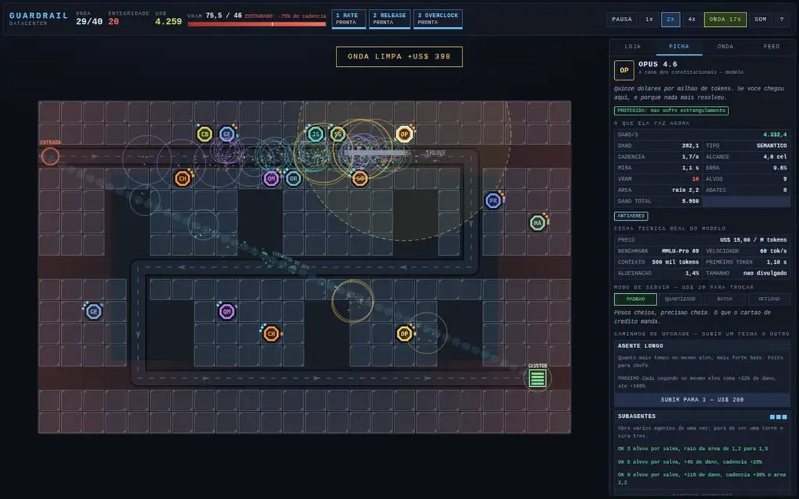

# GUARDRAIL

Defesa de torre de inteligência artificial. **As torres são os modelos** —
comprados com dinheiro, com preço, benchmark, velocidade e contexto reais. **Os
inimigos são as pragas da IA** — alucinação, prompt injection, bot farm,
deepfake, golpe, cripto pump. Você não atira nos modelos: você usa os modelos.

É o irmão de gênero de
[`attention-is-all-you-kill`](../attention-is-all-you-kill/README.md): mesmo
universo, mecânica oposta.

- **Jogar:** abra o `index.html` desta pasta, ou vá pelo hub
- **Parte de:** [ai-games](../../README.md)



## A regra que manda no jogo: o cluster é finito

Cada modelo que você sobe ocupa **VRAM** de um cluster de tamanho fixo. Se você
estourar o orçamento, **todas as suas torres ficam mais lentas** — exatamente o
que acontece na vida real quando a fila não cabe na memória.

Isso muda a pergunta central. Não é "quanta torre cabe no mapa": é **quantos
modelos cabem no cluster**. E é por isso que os modos de servir são decisão de
partida e não enfeite:

| modo | VRAM | dano | cadência | mira |
| --- | --- | --- | --- | --- |
| PADRÃO | x1 | x1 | x1 | x1 |
| QUANTIZADO | x0,55 | x0,78 | x1 | x1 |
| BATCH | x1,45 | x1 | x1,35 | x1,25 |
| OFFLOAD | x0,35 | x1 | x0,62 | x1,9 |
| MOE | x0,5 | x1 | x1 | x1 |

MoE só existe em quem é MoE de verdade, e um tiro em cada dois roteia para o
especialista errado e sai com 55% do dano. Trocar custa US$ 20 e o servidor
leva 2,5 segundos para subir os pesos de novo.

Duas coisas atacam o orçamento de fora: o **BOT FARM**, em que cada bot vivo
come 0,14 de VRAM do seu cluster, e o **OOM KILLER**, que sequestra 2,2 do
**teto** enquanto está vivo. E o **DE CASACO DE COURO** vende GPU o jogo
inteiro: +8 de VRAM, 62% mais caro a cada compra.

## As torres são modelos, e os números são deles

Nada aqui é inventado. Cada atributo sai de um dado real e a conversão está
escrita ao lado dele no jogo:

| dado real | vira |
| --- | --- |
| preço em US$ por milhão de tokens | custo de compra |
| benchmark (MMLU-Pro) | dano por golpe |
| tokens por segundo | cadência |
| janela de contexto | alcance |
| latência do primeiro token | tempo de mira antes do primeiro tiro |
| taxa de alucinação | chance de errar o tiro |
| postura de segurança | recusa a atirar em quem parece inocente |
| tamanho servido | consumo de VRAM |

| modelo | custo | VRAM | dano | cadência | alcance | mira | erra | tipo |
| --- | --- | --- | --- | --- | --- | --- | --- | --- |
| Llama 8B | 55 | 1 | 6 | 3,2/s | 2,6 | 0,15 s | 9,8% | TOKEN |
| Claude Haiku 4.5 | 85 | 2 | 9 | 2,4/s | 3,2 | 0,35 s | 4,2% | TOKEN |
| Gemini Flash | 130 | 3 | 11 | 2,8/s | **5,4** | 0,28 s | 5,1% | VETOR |
| Qwen 3 VL | 150 | 3 | 8 | 1,9/s | 3,6 | 0,50 s | 6,4% | FILTRO |
| DeepSeek R1 | 200 | 7 | 46 | 0,55/s | 3,0 | **2,40 s** | 7,9% | SEMÂNTICO |
| Claude Sonnet 4.5 | 240 | 5 | 21 | 1,5/s | 3,4 | 0,60 s | 2,1% | SEMÂNTICO |
| GPT-5 | 360 | 8 | 30 | 1,7/s | 4,2 | 0,70 s | 2,8% | TOKEN |
| Claude Opus 4.6 | 560 | 10 | 62 | 1,1/s | 4,8 | 1,10 s | **1,4%** | SEMÂNTICO |

O DeepSeek R1 pensa 2,4 segundos antes do primeiro tiro. Isso não é um número
de equilíbrio: é o TTFT dele. O Gemini enxerga o mapa quase inteiro porque
tem um milhão de tokens de contexto. O Claude Sonnet erra uma em cinquenta e **se
recusa a atirar em quem ainda parece usuário legítimo** — o que faz dele a pior
torre possível contra DEEPFAKE até você comprar a CONSTITUIÇÃO nível 3.

Mais três construções que não são modelos e não atiram: **A SEGURA** (+7 de
VRAM e ninguém no raio dela sofre estrangulamento), o **ORQUESTRADOR** (+30% de
cadência em volta) e a **COBRANÇA** (US$ 26 por onda, e nada mais).

**Cada torre encarece a próxima do mesmo tipo em 25%.** Variar sai mais barato
que empilhar. Vender devolve 60%.

### Onze silhuetas, porque onze siglas não bastavam

No mapa a torre tem 32 px. Até aqui as onze eram o mesmo octógono com duas
letras dentro — e duas letras a 32 px, num mapa com 26 torres, não se lê: você
decorava a cor. Agora cada uma é uma silhueta própria, desenhada em caminho de
canvas (`js/icones.js`, nenhum arquivo de imagem) e rasterizada uma vez em
cache.

Três regras seguram o conjunto, e foram conferidas em cinza e com desfoque
antes de virar código:

1. **A forma separa sozinha.** Sem cor e sem ler a sigla. O teste é brutal de
   propósito: em cinza e com 2,5 px de desfoque, duas torres não podem virar a
   mesma bolha. Foi ele que reprovou o nó hexagonal da OpenAI — a 32 px
   desfocado ele vira o mesmo disco do Claude Opus — e o GPT-5 ficou com o
   portal, a única forma das onze com um vão vazado no meio.
2. **Quem não atira se declara.** A SEGURA, o ORQUESTRADOR e a COBRANÇA
   dividem a cor de aço e a barra de base com pés. São exatamente 3 dos 11:
   "esta torre não atira" se lê de longe, antes de qualquer texto.
3. **A casa se lê na contagem.** Claude Haiku, Sonnet e Opus são o mesmo
   asterisco com 3, 6 e 12 raios, e ganhando massa e luminância nessa ordem.
   O degrau é a forma, não a legenda.

A sigla de duas letras continua dentro do ícone, menor. Ela funciona na loja e
na ficha, e some no mapa — e isso é o esperado: lá quem fala é a forma.

Nível e proteção ficam **fora** do corpo, porque não há mais um octógono comum
onde encostar: são traços radiais no topo (caminho 0 para a esquerda, caminho 1
para a direita) e um aro fino verde quando A SEGURA cobre a torre. A torre
selecionada é marcada por cantos nos quatro vértices da célula, e não por um
contorno branco por cima — o GPT-5 é quase branco e desapareceria dentro dele.

## Caminhos de upgrade: escolher um fecha o outro

Cada uma das onze construções tem **dois caminhos de três níveis**. Você pode
pegar nível 1 nos dois, mas no instante em que um chega ao 2, o outro tranca
em 1 para sempre. É onde o jogo deixa de ser "comprei mais um nível" e passa a
ser "escolhi ser o quê".

O Llama 8B é o exemplo mais curto: pelo **FINE-TUNE** ele vira uma torre de dano
SEMÂNTICO que quase não erra; pelo **ENXAME LOCAL** ele vira 12,6 tiros por
segundo de RUÍDO que deixa lento e marca o alvo. São duas torres diferentes com
o mesmo nome, e você não tem as duas.

## Cinco tipos de dano, e cada um resolve o que os outros não resolvem

| tipo | resolve |
| --- | --- |
| TOKEN | dano direto e barato. É o único que entra inteiro no GOLPE, que é burro demais para o classificador grande levar a sério |
| VETOR | dano em área. Única coisa que fura ARMADURA DE VOLUME e a única que dá conta de enxame |
| SEMÂNTICO | única coisa que atravessa ESCUDO SEMÂNTICO |
| FILTRO | dano contínuo, e revela quem está camuflado |
| RUÍDO | pouco dano, deixa lento e marca — e é o único que quebra o DEEPFAKE, porque analisar o conteúdo dele não adianta: o conteúdo é perfeito |

Duas pragas quebram esse esquema de propósito. O **VIÉS** só recebe dano de um
tipo sorteado, escrito no corpo dele. O **OVERFITTING** decora o tipo que mais
levou e fica imune a ele, até três tipos. Contra os dois, a saída é **furar
resistência** — que é uma regra só, e vale para tudo: GPT-5 no RACIOCÍNIO ALTO,
a aura do ORQUESTRADOR e o RELEASE DE EMERGÊNCIA.

## As pragas

Vinte e três tipos, cada um com uma regra própria e nenhum que seja só "mais
HP". Estreiam uma por vez até a onda 20; depois o jogo passa a combinar.

| onda | praga | a regra |
| --- | --- | --- |
| 1 | ALUCINAÇÃO | uma em cada três é falsa: some no primeiro dano e não paga nada |
| 2 | BOT FARM | vem às dezenas; o problema não é matar, é o compute que elas comem |
| 3 | GOLPE | nos últimos 25% do percurso rouba US$ 3 por segundo do seu caixa |
| 4 | PROMPT INJECTION | encostou numa torre, vira ela contra você por 4 segundos |
| 5 | GROQUE | desliga uma torre a cada 2,6 segundos, e comenta no feed |
| 6 | MODO ANÔNIMO | invisível para quem não tem detecção |
| 7 | FORK | ao morrer divide em dois; um vira sete |
| 8 | ARMADURA DE VOLUME | tiro de alvo único entra a 25%; área entra inteiro |
| 9 | CRIPTO PUMP | ganha 9% de HP e 3,5% de velocidade por segundo vivo |
| 10 | MODEL COLLAPSE | ao morrer renasce, duas vezes, imune a mais um tipo por vez |
| 11 | INFERÊNCIA NA BORDA | ignora a trilha e corta o mapa reto: só antiaéreo acerta |
| 12 | ESCUDO SEMÂNTICO | TOKEN entra a 10%; só SEMÂNTICO entra inteiro |
| 13 | DEEPFAKE | entra disfarçado de usuário e se revela na metade do caminho |
| 14 | CURADOR RLHF | cura 16 HP/s em todo mundo em volta |
| 15 | O REPTILIANO | 4 segundos visível, 3 segundos camuflado fora do espectro |
| 16 | CHECKPOINT | se demorar 9 segundos para morrer, volta 6 células e se cura |
| 17 | VIÉS | só recebe dano de um tipo, sorteado e escrito no corpo |
| 19 | OVERFITTING | decora o tipo que mais levou e fica imune a ele |
| 20 | SAM ALTO HOMEM | invulnerável enquanto promete AGI, e chama a plateia |
| 25 | O FOGUETEIRO | derruba um veículo na sua laje a cada 5,5 segundos |
| 30 | SCROLL INFINITO | regenera 3,4% do HP por segundo: ou você concentra, ou ele nunca cai |
| 34 | OOM KILLER | enquanto vive, sequestra 2,2 do teto do seu cluster |
| 40 | O LARANJA | ergue um muro de 700 de HP que barra todo tiro que tentar atravessar |

## Três mapas que pedem coisas diferentes

| mapa | rota | lajes | VRAM | o que ele cobra |
| --- | --- | --- | --- | --- |
| DATACENTER | 63 células, uma entrada | 244 | 26 | rota longa e cluster generoso: ensina a gastar VRAM sem medo |
| CRUZAMENTO | 63 e 60 células, duas entradas | 181 | 22 | dois pipelines que se cruzam três vezes, cluster apertado: quantizar deixa de ser opcional |
| ILHA CENTRAL | 113 células em espiral | 118 | 14 | quase tudo é lago; a espiral passa três vezes pelas ilhas do meio. Alcance vale mais que cadência |

Mais o **modo sem fim**, que continua depois da onda 40 com chefe a cada cinco
ondas e HP subindo de verdade.

## Informação total

Esconder número não deixa o jogo mais difícil, deixa mais chato — o jogador vai
procurar a fórmula na internet. Então:

- clique em **qualquer torre** e veja dano por segundo, dano por golpe, cadência
  real (já com aura e estrangulamento aplicados), alcance em células, tempo de
  mira, chance de erro, VRAM, abates, dano total acumulado, o que cada nível dos
  dois caminhos faz e quanto custa, e a ficha técnica real do modelo;
- clique em **qualquer praga** e veja HP atual e máximo, velocidade, quanto ela
  paga, quantas células faltam, quanto por cento de cada um dos cinco tipos de
  dano ela recebe, e cada efeito ativo **com o tempo que falta**;
- a aba ONDA mostra a próxima onda inteira antes dela começar: que tipo vem,
  quantos, com quanto de HP, qual evento global está engatilhado, e quais tipos
  ainda vão estrear mais para a frente;
- tudo em número absoluto. Nunca "+50%".

E o controle de tempo é do jogador: **pausa com poder construir, melhorar,
vender e trocar modo de servir durante a pausa**, 1x / 2x / 4x, e um botão de
antecipar a onda que paga 2,5 vezes o preparo que sobrou.

## Como se joga

| ação | como |
| --- | --- |
| construir | clique na torre da loja, depois na laje |
| construir várias | segure <kbd>shift</kbd> ao clicar na laje |
| ver os números | clique em qualquer torre ou praga do mapa |
| habilidades | <kbd>1</kbd> RATE LIMIT, <kbd>2</kbd> RELEASE DE EMERGÊNCIA, <kbd>3</kbd> OVERCLOCK |
| pausar | <kbd>espaço</kbd> ou <kbd>P</kbd> — dá para construir pausado |
| velocidade | <kbd>[</kbd> e <kbd>]</kbd> |
| antecipar onda | <kbd>N</kbd> |
| vender | <kbd>V</kbd> com a torre selecionada |
| manual | <kbd>H</kbd> |

No celular é tudo toque: a barra de cima quebra em três linhas para as
habilidades e o controle de tempo caberem, e o mapa continua inteiro na tela.

## Como foi testado

`js/jogo.js` não tem uma linha de DOM. Isso é proposital: defesa de torre se
equilibra por número, e número só se confere rodando. O navegador e o
`provas.mjs` executam exatamente o mesmo arquivo, com o mesmo passo fixo de
1/60 — o botão 4x roda quatro passos por quadro, não muda o equilíbrio.

```
node provas.mjs
```

São **61 provas** em nove blocos: os mapas, as torres, o orçamento de compute,
as pragas, as ondas, o controle de tempo, a sinergia, a higiene de estado entre
partidas, e a que importa — um robô que joga as 40 ondas nos três mapas.

```
datacenter  40 ondas  integridade 11/20  26 torres de 11 modelos  1314 pragas mortas
cruzamento  40 ondas  integridade 13/20  26 torres de 11 modelos  1332 pragas mortas
ilha        40 ondas  integridade 13/16  26 torres de 11 modelos  1304 pragas mortas
```

### Os sete defeitos que o robô achou e que jogar não acharia

1. **VIÉS sorteado em RUÍDO era imortal.** Nenhuma torre produzia dano de RUÍDO.
   Jogando, você nunca ia ver: o sorteio cai em RUÍDO uma vez em cinco, e na
   onda em que isso acontece você culpa a sua build.
2. **OVERFITTING decorava os cinco tipos** e virava imortal. Teto de três.
3. **A onda 11 punia quem construiu onde o jogo mandou construir.** O voador
   corta o mapa em linha reta, e o corredor de voo era invisível; nenhuma torre
   acessível tinha antiaéreo. O robô perdia treze voadores por partida. Agora o
   corredor é desenhado no mapa, três modelos já nascem com antiaéreo e a
   AUDITORIA da SEGURA dá antiaéreo por aura.
4. **MODEL COLLAPSE renascia no lugar onde morria**, com 35% mais velocidade e
   pouco caminho pela frente: chegava no cluster em todas as partidas. Renascer
   passou a ser voltar ao início da rota.
5. **O muro do LARANJA ficava no mapa depois que o dono morria** — no modo sem
   fim eles empilhavam até fechar o mapa.
6. **Chefe soltava muro, veículo e pitch no quadro em que nascia**, antes de o
   jogador ver que ele chegou.
7. **Três lajes do CRUZAMENTO não alcançavam trilha nenhuma.** Laje que não
   alcança nada é armadilha, não decisão.

### A prova que mais rendeu

A verificação de laje olhava **da laje para a trilha**: toda laje precisa cobrir
algum pedaço de caminho. A ILHA CENTRAL passava nela. Só que a pergunta certa é
a inversa — **da trilha para a laje** — e por ela 55% da espiral estava fora do
alcance de qualquer torre que fosse possível construir. Meia rota era cenário:
o jogador via a praga andar meio minuto sem levar um tiro.

Com a prova nova (80% da rota defensável, e no máximo 12 células seguidas sem
cobertura) e quatro plataformas novas, a partida da ilha caiu de 33 para 16
minutos, porque as pragas passaram a morrer onde deviam.

### Desempenho

Não consigo declarar "60 fps medidos" com honestidade: o único navegador
disponível aqui é headless e rasteriza na CPU (SwiftShader), e nele **um único
`fillRect` de tela cheia custa os mesmos ~180 ms por quadro que o jogo inteiro
desenhando**. O custo é do compositor, não do jogo — desenhar mais não ficava
mais lento que desenhar um retângulo.

O que dá para medir, e está medido, com **126 pragas, 24 torres e o cluster
estourado**, forçando rasterização completa a cada quadro:

| parte | custo por quadro |
| --- | --- |
| desenho | 6,06 ms |
| simulação | 0,59 ms |
| **total** | **6,65 ms** de um teto de 16,6 ms |

Era 19,06 ms de desenho antes de três correções que a medição apontou: selo de
torre e de praga em cache (o corpo de cada uma é rasterizado uma vez por
combinação de forma, cor e raio, em vez de 120 `stroke` por quadro), fundo com
`alpha: false` (copiar 576 mil pixels deixou de ser mistura) e vinheta
pré-rasterizada recortada na faixa de borda — ela sozinha custava 5,4 ms, mais
do que todas as pragas somadas.

A simulação pura, em Node e sem navegador nenhum, custa **0,63 ms por quadro com
130 pragas na tela** — número que o `provas.mjs` imprime toda vez que roda.

## Estrutura

```
index.html        casca, HUD, painéis e manual
css/style.css     layout, e a quebra do topo em três linhas no celular
js/main.js        cliques, toque, teclado, painéis e laço — a única parte com DOM
js/jogo.js        o jogo inteiro: ondas, mira, dano, compute, chefes, economia
js/dados.js       modelos, tipos de dano, modos de servir, pragas, habilidades
js/mapas.js       os três mapas e o corredor de voo
js/ondas.js       as 40 ondas e o gerador do modo sem fim
js/render.js      canvas 2D com fundo e selos em cache
js/icones.js      as onze silhuetas das torres, em caminho de canvas e em cache
js/noticias.js    o banco de manchetes do feed
js/som.js         efeitos sintetizados em Web Áudio
js/robo.js        o robô que joga sozinho
provas.mjs        as 61 provas
```

Sem dependência, sem build, sem CDN, sem npm em runtime e sem um único arquivo
de imagem ou de áudio. A única imagem da pasta é a `capa.jpg`, captura do jogo
rodando.

O som de tiro tem teto de um a cada 55 ms e passa por um limitador. Sem isso,
quarenta tiros por segundo na onda 30 viram serra elétrica e a primeira reação
de quem joga é desligar o som.
