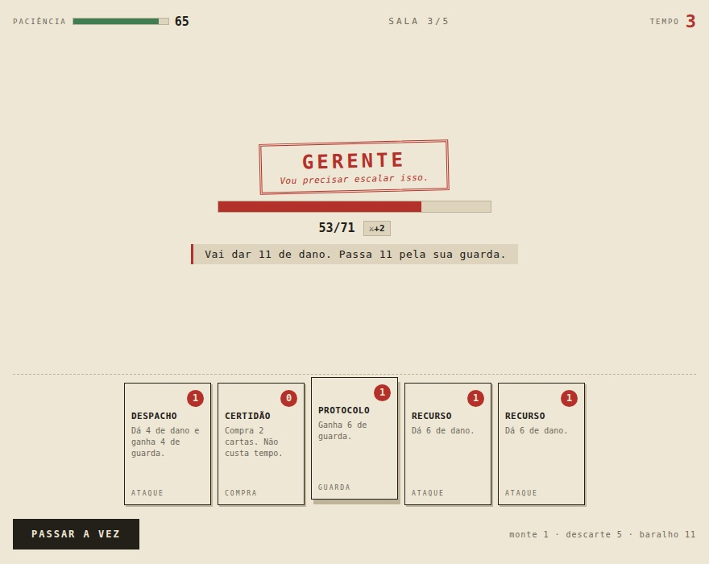

# PROCESSO

Jogo de cartas com construção de baralho. Seu requerimento tem cinco instâncias:
do atendente que diz que não é com ele até O Setor Responsável, que está fora do
ar.

- **Jogar:** abra o `index.html` desta pasta, ou vá pelo hub
- **Parte de:** [ai-games](../../README.md)



## Como se joga

**Paciência** é sua vida. **Tempo** é sua energia, e volta a 3 todo turno.
**Guarda** absorve o golpe e some no fim do turno — guardar a mais não acumula.

Clique na carta para jogar, ou <kbd>1</kbd>–<kbd>9</kbd>. <kbd>espaço</kbd> passa
a vez. Entre as salas você escolhe uma carta nova para o processo, ou segue sem
nada — diluir o baralho também custa.

O servidor **sempre anuncia o próximo golpe**, com o número já somado à força
dele e o quanto passa pela sua guarda. Jogo de carta sem telegrafo vira sorteio,
e sorteio não tem decisão.

## Como foi equilibrado

`js/combate.js` não tem uma linha de DOM e o sorteio é semeado. As duas coisas
juntas permitem rodar milhares de corridas e medir o que só se mede rodando.

### A taxa de vitória

O alvo era 30–65% para quem joga de forma apenas razoável: acima disso a corrida
não oferece resistência, abaixo vira parede. O caminho até lá foi feio:

| tentativa | taxa | onde morria |
| --- | --- | --- |
| primeira versão | **0%** | 91% no auditor |
| depois de afrouxar | **0,6%** | 97% no chefe |
| com teto de força | **2,0%** | 96% no chefe |
| depois da varredura | **41,8%** | chefe |
| com as cartas ajustadas | **51,5%** | chefe |

O que consertou não foi chutar valor por valor: foi **varrer os parâmetros**.
Rodar a simulação para uma grade de multiplicadores e olhar onde a taxa cai
mostrou a combinação certa de uma vez.

Nesse caminho apareceu um erro de julgamento meu que vale registrar: depois da
varredura eu "arredondei com bom senso" e subi a paciência do auditor de 68 para
78, para manter a ordem crescente. A taxa desabou de 41,8% para 23,9%. A ordem
crescente não é lei — o auditor incomoda pelo padrão de golpe, não pelo tamanho.

### O valor real de cada carta

Contar qual carta foi mais escolhida é circular: isso mede a tabela de notas do
robô, não o jogo. A medição honesta é rodar corridas **forçando** cada carta e
comparar a vitória com a da escolha livre.

Ela achou três problemas:

- **PRAXE era dominante.** Dava 3 por carta na mão — cerca de 12 de dano por 1 de
  tempo, contra 13 por 2 da petição. Forçá-la subia a vitória de 40% para **70%**.
  Virou 2 por carta.
- **LIMINAR e ARQUIVAMENTO eram armadilhas**, 20 pontos abaixo da alternativa.
  A liminar custava o turno inteiro de tempo; atordoar não paga isso.
- **HORA EXTRA saiu do jogo.** Ficou 23 pontos abaixo em todas as rodadas. Carta
  que nunca compensa pegar não é escolha difícil, é slot de recompensa
  desperdiçado.

No fim, nove cartas dentro de uma faixa de +15 a −5 pontos. Toda carta é uma
escolha razoável, algumas melhores que outras.

### O jogo tem decisão mesmo?

Uma pergunta que se respondeu sozinha. O primeiro robô que jogou no **navegador**
era mais simples que o do simulador: faltavam duas regras — *não se defenda
quando dá para matar* e *cure quando a paciência acaba*. Ele perdeu **6 de 6**
corridas. Com as duas regras, ganhou **6 de 12**, batendo com os 51,5% simulados.

Duas decisões valem ~50 pontos de vitória. É a diferença entre um jogo e um
sorteio.

## Por que DOM e não canvas

Os outros jogos deste repositório desenham em canvas. Aqui não: carta é texto, e
texto em canvas é briga desnecessária com quebra de linha, foco e leitor de tela.
Cada carta é um `<button>` de verdade — navega por Tab e responde a Enter sem uma
linha de código extra. A textura de papel são duas tramas de gradiente cruzadas,
sem arquivo de imagem.

## Estrutura

```
index.html      a mesa
css/style.css   papel, carimbo, cartas, telas estreitas
js/main.js      liga o combate ao DOM — a única parte que conhece o navegador
js/combate.js   combate e corrida, sem DOM, com sorteio semeado
js/dados.js     cartas, servidores e salas — equilibrar é mexer aqui
js/som.js       efeitos sintetizados em WebAudio
```

Sem dependência, sem build, sem CDN e sem um único arquivo de imagem ou de áudio.
A única imagem da pasta é a `capa.jpg`, captura do jogo rodando.
