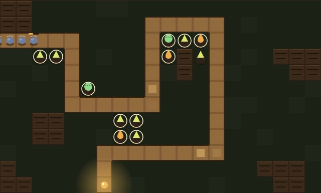

# SEIVA

Defesa de torre num tronco de árvore. O miolo está sendo comido por dentro:
plante espinho, esporo, resina e ferrão na terra ao redor da trilha e segure
dez ondas.

- **Jogar:** abra o `index.html` desta pasta, ou vá pelo hub
- **Parte de:** [ai-games](../../README.md)



## Como se joga

Escolha uma torre na barra, clique na terra para plantar. Clique numa torre
plantada para ver o alcance dela, <kbd>M</kbd> para melhorar, <kbd>V</kbd> para
vender (volta 60%). <kbd>1</kbd>–<kbd>4</kbd> escolhem a torre, <kbd>espaço</kbd>
manda a próxima onda, e o botão <kbd>1×</kbd> acelera até 3×.

| torre | o que faz |
| --- | --- |
| ESPINHO | barato e direto, um alvo por vez |
| ESPORO | acerta todo mundo por perto, fraco sozinho |
| RESINA | quase não machuca, deixa tudo lento |
| FERRÃO | caro, lento e longe; ignora casca dura |

**Cada torre encarece a próxima do mesmo tipo.** A árvore não sustenta mais do
mesmo: variar sai mais barato que repetir. Essa regra não é enfeite temático —
ela existe porque a simulação provou que, sem ela, o jogo não tinha decisão
nenhuma (abaixo).

## Como foi testado

`js/jogo.js` não tem uma linha de DOM. Isso é proposital: defesa de torre se
equilibra por número, e número só se confere rodando. Com o jogo separado do
desenho, dá para simular as dez ondas em Node e responder três perguntas que
olhar não responde.

### 1. Dá para vencer sem plantar nada?

Tem que ser não, senão o jogo é vazio. **Não**: cai na onda 2.

### 2. Dá para vencer jogando de forma razoável?

Tem que ser sim, senão o jogo é injusto. **Sim**: vence com 11 de 12 corações.

### 3. Dá para vencer só com a torre mais barata?

Essa é a pergunta que salvou o jogo. Na primeira versão, **espalhar 35 espinhos
baratos vencia sem perder uma vida sequer**. Isso reduz o jogo a "repita a torre
barata" e transforma as outras três em enfeite — não havia decisão nenhuma a
tomar.

A correção foi o custo crescente por tipo. Depois dela, os números viraram:

| estratégia | resultado |
| --- | --- |
| não plantar nada | derrota na onda 2 |
| só espinho | vitória, **6**/12 corações, 15 torres |
| variando as torres | vitória, **11**/12 corações, 17 torres |

Variar passou a valer quase o dobro em corações. É a diferença entre uma regra
que existe no texto e uma que existe no jogo.

### E o motor do navegador é o mesmo do simulado?

Essa pergunta também precisou de resposta, porque uma simulação que não bate com
o jogo não prova nada. A mesma estratégia foi rodada nos dois:

```
navegador: fim=vitoria vidas=11/12 torres=17 mortas=163
Node     : fim=vitoria vidas=11/12 torres=17 mortas=163
```

Idêntico.

De quebra, isso explicou um susto pelo caminho: uma partida de teste com torres
postas **a olho** perdeu na onda 4. Não era bug — era colocação ruim. O jogo
cobra posicionamento, que é exatamente o que ele deveria cobrar.

## Um erro que só a captura de tela mostrou

A primeira versão pintou trilha, terra e casca em marrons do mesmo valor, e o
tabuleiro simplesmente sumia. Defesa de torre é um jogo de ler o mapa de longe,
e a trilha é o elemento que mais precisa saltar — é por onde a praga vem.

A hierarquia foi refeita: canal claro com borda escura para a trilha, terra
plantável puxada para o verde escuro, casca em blocos com relevo. E as marcas de
"pode plantar aqui" viraram quatro cantinhos em vez de retângulos, que formavam
uma grade competindo com a trilha.

## Estrutura

```
index.html      casca, HUD, barra de torres
css/style.css   layout e telas estreitas
js/main.js      cliques, teclado, laço — a única parte que conhece o navegador
js/jogo.js      o jogo: torres, pragas, tiros, economia, ondas (sem DOM)
js/mapa.js      trilha, casca, tabela de torres, pragas e ondas
js/desenho.js   render em canvas
js/som.js       efeitos sintetizados em WebAudio
```

Sem dependência, sem build, sem CDN e sem um único arquivo de imagem ou de áudio.
A única imagem da pasta é a `capa.jpg`, captura do jogo rodando.

O som de tiro tem teto de um a cada 70 ms. Sem isso, dez torres atirando juntas
viram serra elétrica na terceira onda.
