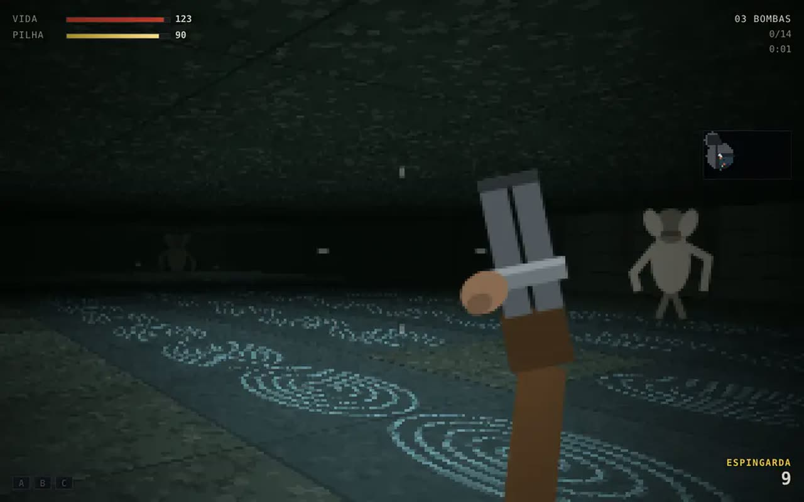

# SUBSOLO

Sobrevivência por rodadas numa mina de manganês reaberta como depósito, em 3D,
no navegador, com WebGL2 escrito à mão: sem biblioteca, sem arquivo de modelo,
sem textura em disco.

A mina é escura de verdade. Você tem uma lanterna, uma pistola, quinhentos
pontos e duas janelas com tábuas. A cada rodada chega mais gente, mais rápido, e
com mais vida — e o que você faz com os pontos entre uma rodada e outra é o jogo.

- **[Jogar](https://luccapinto.github.io/ai-games/games/subsolo/)** ou abra
  `index.html` desta pasta servido por HTTP (ver [Rodar](#rodar))
- **Parte de:** [ai-games](../../README.md)



## O laço

| ação | tecla |
| --- | --- |
| mover | <kbd>W</kbd> <kbd>A</kbd> <kbd>S</kbd> <kbd>D</kbd> |
| olhar | mouse (clique na tela para travar o cursor) |
| atirar | clique ou <kbd>espaço</kbd> |
| recarregar | <kbd>R</kbd> |
| usar / comprar | <kbd>E</kbd> |
| trocar de arma | <kbd>Q</kbd> |
| correr | <kbd>shift</kbd> (4,2 s de vigor) |
| lanterna | <kbd>F</kbd> |
| pausar | <kbd>esc</kbd> |

**Ponto vem de dano, não de morte:** 10 por acerto, 60 por morte, **100 por
morte na cabeça**. Sem ponto por acerto, uma arma forte seca a economia e o
jogador chega na rodada 15 sem ter comprado nada.

Com ponto você compra: **vão de escombro** (abre uma zona nova), **arma de
parede**, **munição** (45% do preço da arma), **caixa misteriosa** (950, arma
sorteada), **forja** (5.000, dobra o dano e aumenta o pente) e **perks** — que
só funcionam depois de ligar a força na subestação.

| perk | custo | o que faz |
| --- | --- | --- |
| CALDO | 2.500 | dobra a vida |
| GRAXA | 3.000 | recarrega no dobro |
| GATILHO | 2.000 | cadência 1,85× |
| TALISMA | 1.500 | levanta você sozinho, uma vez |

Zumbi não mata: **derruba**. Caído, você rasteja e sangra por 32 segundos — o
TALISMA é a diferença entre um erro e o fim da partida.

## Os dois mapas

Quatro zonas em anel cada um. **O anel é requisito de projeto, não enfeite:**
num jogo de horda, mapa sem volta é mapa onde a rodada 12 mata todo mundo no
mesmo canto, sempre. As provas medem o tamanho da volta e quantas zonas ela
cruza, porque "tem volta" precisa ser número e não opinião.

| mapa | zonas | janelas | máquinas | piso | volta | custo de abrir tudo |
| --- | --- | --- | --- | --- | --- | --- |
| BOCA DA MINA | 4 | 12 | 11 | 561 células | 216 células | 4.000 |
| POÇO FUNDO | 4 | 12 | 11 | 446 células | 166 células | 5.000 |

Zumbi nasce **só em zona aberta**: comprar menos mapa é comprar menos janela
para defender. Ficar no galpão de entrada com três janelas para sempre é uma
estratégia legítima, e o jogo não proíbe.

## A escada

| rodada | zumbis | vida | velocidade | intervalo | composição |
| --- | --- | --- | --- | --- | --- |
| 1 | 5 | 150 | 1,25 m/s | 3,40 s | 5 comuns |
| 5 | 15 | 550 | 1,80 m/s | 1,99 s | 10 comuns + 5 rastejantes |
| 7 | 20 | 750 | 2,40 m/s | 1,51 s | 14 comuns + 1 capataz |
| 10 | 27 | 1.055 | 3,00 m/s | 0,99 s | 27 comuns |
| 15 | 34 | 1.777 | 3,60 m/s | 0,55 s | 20 comuns + 12 rastejantes |
| 25 | 34 | 5.045 | 4,10 m/s | 0,55 s | 21 comuns + 11 rastejantes |

O degrau que importa é o da rodada 15: dali para frente o zumbi anda mais
rápido do que você **andando**, e correr deixa de ser opcional. Na rodada 40 ele
ainda é mais lento do que você **correndo** — sem isso não haveria fuga, e o
jogo viraria loteria.

Três tipos, e o capataz não é um zumbi com mais vida: ele é **blindado** (corta
45% do dano de corpo e nada do dano de cabeça), lento e bate o dobro. Rajada no
peito não resolve; mira resolve.

## As armas

Nenhuma arma é "a melhor" — cada uma ganha em um eixo e perde em outro, e as
provas cobram essa tabela: se uma arma dominar dano de perto, dano de cabeça a
distância, pente e preço ao mesmo tempo, a escolha morre.

| arma | custo | dps de perto | dps de cabeça a 18 m | pente | alcance | eixo |
| --- | --- | --- | --- | --- | --- | --- |
| PICARETA | 0 | 275 | 0 | ∞ | 2,2 m | não gasta nada |
| PISTOLA | 0 | 483 | 843 | 10 | 34 m | a que você já tem |
| PINEIRA | 1.300 | 399 | 768 | 32 | 26 m | sustenta corredor |
| ESPINGARDA | 1.500 | 512 | 0 | 6 | 13 m | cerco de perto |
| MACARICO | 2.200 | 271 | 0 | 90 | 5,2 m | pega quatro juntos |
| CARABINA | 2.600 | 392 | 1.646 | 8 | 60 m | cabeça a distância |

A forja multiplica dano por 2,6 e pente por 1,6. A prova cobra que a rodada 25
(5.045 de vida) caia em **no máximo quatro tiros de cabeça** da carabina
forjada — sem isso o jogo teria um teto invisível, e o jogador perderia sem
entender por quê.

## O que dá o tom

**A luz é a decisão de render mais importante.** Três fontes, calculadas por
fragmento: a lanterna (um refletor cônico preso na câmera, com queda suave na
borda), as lâmpadas da planta (as oito mais próximas, as mesmas que o mapa usa
para decidir o que está iluminado) e o **clarão do cano** — o tiro é uma luz de
verdade por 60 ms, e é ele que mostra o corredor no escuro.

**A rocha não tem textura de arquivo.** O fragmento sombreia por ruído de
posição de mundo em duas escalas, o que dá grão de pedra sem repetir com padrão
visível — e sem nenhum byte de imagem.

**Oclusão por vértice nas quinas.** Numa mina sem sol, quina escura é a única
pista de forma que o olho tem quando a lanterna está apontada para outro lado.

**Zumbi tem seis partes.** Tronco, cabeça, dois braços e duas pernas, cada um
com a sua matriz. A caminhada sai da mesma fase que o jogo usa; quem morde
estica os braços; o rastejante é o mesmo modelo deitado — não existe segundo
modelo.

**A navegação é um campo de fluxo, não A\* por bicho.** Uma busca em largura a
partir do jogador, refeita quatro vezes por segundo, serve os vinte e quatro
zumbis. Vinte e quatro A\* custariam mais que o resto do jogo junto e daria o
mesmo resultado, porque todos perseguem o mesmo ponto.

## As provas

`provas.mjs` roda o jogo inteiro sem navegador: mapa, rodadas, armas, economia,
e **um robô que joga**. São **36 provas**.

O robô é a prova principal. Ele lê o mesmo estado que a tela mostra, manda os
mesmos comandos que o teclado manda e não vê através de parede. Ele arrasta
horda subindo o gradiente de distância da horda, mira na cabeça com erro
proporcional à distância, e compra numa ordem: força, munição, arma, CALDO,
TALISMA, vão, forja, resto.

Em seis partidas (dois mapas, três sementes) ele atravessa **cinco rodadas em
todas** e chega à **oitava na melhor**, abrindo pelo menos duas portas, com 62%
a 77% das mortes na cabeça. Gente chega mais longe — ele mede se o jogo é
jogável, não se ele é bom.

Defeitos reais que as provas acharam, e que estariam no jogo sem elas:

- **Uso sem travamento.** Segurar <kbd>E</kbd> comprava munição sessenta vezes
  por segundo. O robô ficou parado na parede da pineira gastando tudo que
  ganhava e morreu na rodada 7 com 11.240 pontos e o mapa fechado.
- **Porta de uma célula prendia zumbi.** Com raio de 0,45 num vão de 1,0 a
  passagem livre para o centro do bicho tinha 0,1 de largura: ele vibrava na
  quina para sempre e a rodada nunca fechava. Porta virou **vão de três
  células**, cobrado uma vez.
- **Alcance de porta menor que o alcance da mão.** A sonda olhava uma célula à
  frente e o alcance de uso é 2,6: dava para ficar do lado da porta, olhando
  para ela, sem conseguir abrir.
- **Arma na mão preta.** Ela é desenhada em espaço de câmera, e a conta da
  lanterna procurava a luz a vinte metros no mundo.
- **Custo de abrir o mapa contado por célula**, não por vão: dizia 12.000 onde
  custa 4.000.
- **A carabina era dominada pela pineira em todos os eixos** enquanto a tabela
  só comparava dano de corpo — o eixo da carabina é cabeça a distância.

## Rodar

```bash
python3 -m http.server 8765
# http://127.0.0.1:8765/games/subsolo/
cd games/subsolo && node provas.mjs
```

ES modules nativos não carregam por `file://`. Precisa de WebGL2.

## O que o dono do repo achou jogando

**Mouse e setas invertidos.** Mesma causa do jogo de kart: o mapeamento de
entrada morava em `main.js`, o unico arquivo que as provas nao carregavam. A
entrada virou `js/entrada.js` e ganhou quatro provas - sinal do mouse, sinal das
setas, mapa de teclas e o giro chegando no jogo com o mesmo sinal.

**A picareta atirava.** Ela usava a mesma funcao da pistola: raio instantaneo,
um alvo so, bonus de cabeca por altura de mira, clarao de cano e som de
disparo. Agora golpe e golpe: varre um arco de 100 graus, pega TODO mundo dentro
dele, nao gasta municao, nao acende nada (o escuro continua escuro) e nao entra
na conta de precisao - precisao e quantos dos seus tiros acertaram.

**Nao dava para atirar em quem estava na sua janela.** O zumbi arrancava tabua
parado na celula de FORA da janela, que e rocha solida para bala. O jogador via
o braco entre as tabuas, atirava e nada acontecia - a barricada deixava de ser
"tempo para atirar" e virava "tempo para nao poder fazer nada". Tabua e vao:
agora quem arranca fica no buraco, o unico lugar por onde o tiro passa. O robo
de prova, que antes parava na rodada 5 a 8, passou a chegar na 8 e na 9.

**E uma quebra que eu mesmo causei.** Ao extrair o modulo de entrada, apaguei
duas funcoes de `main.js`. As 41 provas continuaram verdes, `node --check`
passou (a sintaxe estava certa) e o jogo **nao abria**: o corpo do modulo jogava
`carregarRecordes is not defined` antes de registrar o clique do menu. Quem
descobriu foi o dono do repo. A prova que faltava agora existe: `provas-dom.mjs`
monta uma tela de mentira e o harness carrega `js/main.js` inteiro - todo
identificador, todo import, todo `getElementById` do corpo do modulo.

## Ficha

- **Quem fez:** Lucca Pinto
- **Modelo:** claude-opus-5 via Anthropic, dirigido por Oh My Pi
- **Tamanho:** 6.568 linhas, zero dependência, zero asset
- **Licença:** MIT
