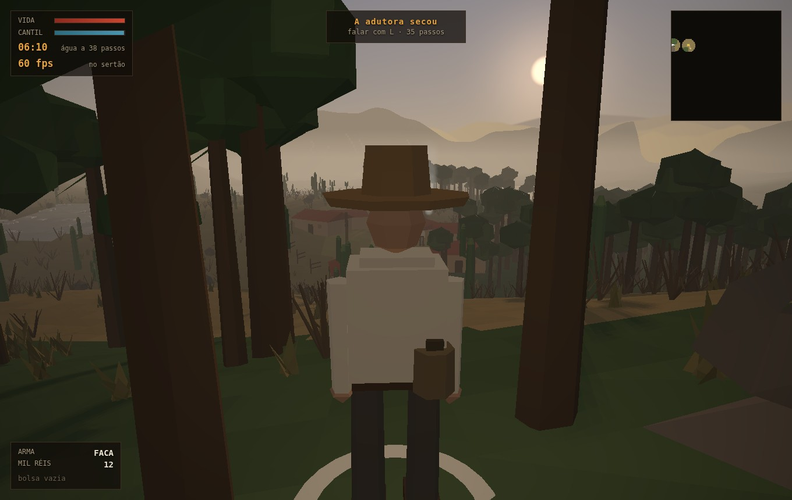

# TRAVESSIA

Mundo aberto no sertão, no navegador, em três dimensões. O mundo é gerado por
semente — relevo, rios, biomas, cinco vilas, estradas e gente — e a sede é que
manda no caminho. Sete missões em linha principal, seis de lado, e trinta
sementes provadas.

O sertão é desenhado em WebGL2 escrito à mão: **nenhum arquivo de textura,
modelo, fonte ou som**. Mandacaru, casa de taipa, onça, letra e rugido saem
todos de código.

- **Jogar:** abra o `index.html` desta pasta (servido por HTTP — veja
  [Rodar local](#rodar-local)), ou vá pelo hub
- **Parte de:** [ai-games](../../README.md)



## Como se joga

| ação | tecla |
| --- | --- |
| andar | <kbd>W</kbd> <kbd>A</kbd> <kbd>S</kbd> <kbd>D</kbd> ou setas, relativo à câmera |
| olhar | mouse — arraste, ou clique para travar o ponteiro |
| aproximar | roda do mouse |
| correr | <kbd>shift</kbd> — gasta mais água |
| golpear | <kbd>espaço</kbd> |
| conversar | <kbd>E</kbd> |
| beber | <kbd>Q</kbd>, perto de água |
| bodega | <kbd>L</kbd>, perto de quem vende |
| diário | <kbd>J</kbd> |
| mapa grande | <kbd>M</kbd> |
| pausar | <kbd>P</kbd> ou <kbd>esc</kbd> |

No celular, o manche do polegar esquerdo anda, o polegar direito olha e os
botões da direita agem.

## O que se vê

Um quadro tem três passadas: **mapa de sombra do sol**, **cena** num alvo fora
da tela e **passada final** com distorção de calor, névoa e vinheta.

A luz não é enfeite, é a regra do jogo ficando visível. O sol anda o arco do
dia em oito minutos e a sombra de tudo gira com ele. Ao meio-dia o céu é azul,
a sombra é curta e o horizonte ferve — e é naquela hora que o cantil dura um
minuto e meio. De madrugada o sertão fica azul-escuro, a névoa se deita no
chão e o lampião do jogador abre um círculo de luz nos pés.

O chão é o mesmo relevo que o gerador já calculava, esculpido em malha
facetada de pedaços de 32 células, com duas resoluções (fina até 52 passos,
grossa depois) e descarte por tronco de visão. A serra ganha um realce de
altura acima do corte que o gerador usa para separar serra de caatinga: sem
ele o relevo é suave demais e a serra — que é parede intransponível no jogo —
não aparecia de longe.

Mato, casa e bicho são desenhados por instância, com três variantes de cada um
e vento por deslocamento de vértice (custo zero de CPU). Gente e onça têm oito
ossos; o oitavo é o cantil no cinto, que encolhe conforme a água acaba.

A câmera fica atrás do jogador, sobe o olhar em subida, não entra no chão e
não treme parada. Perto de casa ela sobe por cima do telhado; o que cair no
corredor entre ela e o jogador — tronco de juazeiro, coluna de mandacaru —
encolhe no próprio sombreador.

## O combate diz o que está acontecendo

O combate era invisível: o jogo não avisava quando o bicho entrava no alcance
do golpe, não distinguia acerto de golpe no vazio e não dizia de onde veio a
mordida. Agora:

- **anel no chão** acende embaixo do bicho quando ele entra no alcance da arma;
- **rugido e seta na borda** quando uma onça percebe você (ela vê a 17 passos);
- **barra de vida e nome** em cima do bicho irritado;
- **assobio** no golpe vazio, **baque** no golpe que acerta;
- **número de dano** subindo, e uma lasca vermelha na borda apontando quem bateu;
- **coração batendo** e barra pulsando abaixo de 30% de vida.

## A sede é a mecânica

O dia inteiro leva oito minutos, e o calor segue uma curva com pico às 13h. O
cantil gasta a soma de três coisas: estar vivo (0,2 por segundo), se mover (0,3
andando, 0,50 correndo) e o calor da hora (até 0,55). Ao meio-dia, andando, o
cantil cheio dura pouco mais de um minuto e meio; de madrugada, quase o dobro.

Daí a decisão que o jogo repete a cada travessia: **ir agora no sol ou esperar a
noite**. Correr chega mais rápido e chega com menos água. Quando o cantil zera, a
vida cai 1,4 por segundo — dá setenta segundos para achar água, o que é susto e
não sentença.

## A onça é decisão, não sentença

A onça fazia 12,3 de dano por segundo e corria a 4,4: o jogador de faca morria
em 8,1 s e não escapava nem andando. Hoje ela faz **7,5 por segundo** (12 de
dano a cada 1,6 s) e corre a **4,0**. A conta muda de lugar:

| o que o jogador faz | o que acontece |
| --- | --- |
| fica e bate | vence em 2,8 s com 79% de vida |
| recua andando (3,4) | morre em 15 s — andar não é fuga, a onça é mais rápida |
| corre (5,6), espera, volta | vence: além de 40 passos a onça desiste |

Essas três lutas são simuladas por `node lutas.mjs`, que roda a mesma
caminhada, a mesma sede e o mesmo combate do navegador.

Meio segundo de carência depois de apanhar impede que dois bichos juntos
encaixem golpe em sequência, e o golpe pega em arco curto: o segundo bicho na
mesma direção leva metade do dano. Vila é abrigo — a onça não entra.

## As moedas compram alguma coisa

O HUD anunciava MIL RÉIS em destaque e não havia o que comprar. Agora todo
vendedor abre bodega (<kbd>L</kbd>): rapadura por 8, cantil grande por 30,
facão por 45 e rifle por 70 mil réis. Os preços saem da própria tabela de
recompensas — a linha principal inteira paga 156 mil réis e as missões de lado
outros 87. O rifle saiu da recompensa da missão da onça: premiar quem mata
onça com a arma de matar onça era circular.

O mundo carrega um campo de distância da água (busca em largura a partir de toda
célula de água e de toda cacimba ao mesmo tempo), e é esse campo que sustenta a
garantia de projeto mais importante do jogo:

> **Todo alvo de missão, todo recurso coletável e todo ponto de estrada tem água
> a menos de meio cantil de distância.**

Isso não é sorte da semente: é provado em trinta mundos por `provas.mjs`.

## O mundo é gerado, e provado

O gerador é ruído de valor somado em oitavas para relevo e umidade; nove rios
descem sempre para o vizinho mais baixo e vestem o vale de mata — e é essa mata
verde-escura que diz ao jogador, de longe, onde tem água. As vilas nascem na
**maior região andável conexa**, a 52 células uma da outra, com roça em volta
(que muda a cor do chão e se vê de longe), cacimba, casas e de três a cinco
pessoas com nome e papel.

O corte entre água, caatinga e serra é um **quantil do próprio relevo daquela
semente**, e não um número fixo. Com corte fixo, a proporção de água ia de 0,5% a
22% entre sementes — a prova de terreno pegou as duas pontas no mesmo dia.

| terreno | semente 1000 | passa |
| --- | --- | --- |
| caatinga | 59,9% | seco, mandacaru, onde tudo acontece |
| serra | 15,9% | não |
| mata | 12,0% | sim, devagar (0,72) |
| água | 6,6% | não — mas se bebe da margem |
| salina | 5,0% | sim, devagar (0,95) |
| roça | 0,5% | sim, é o entorno das vilas |

A estrada é o A\* entre vilas com a estrada custando 0,55 por célula contra 1 da
caatinga, e por isso o caminho prefere estrada quando ela existe — como faz
qualquer um que anda no sertão.

## As missões são um grafo

Treze missões declaradas como **dependência**, não como ordem: sete na linha
principal (cada uma exigindo a anterior) e seis de lado. O que essa forma permite
provar:

- o grafo não tem ciclo (ordem topológica cobre as treze);
- todo dador, todo alvo e toda recompensa **existem naquele mundo**;
- todo alvo é alcançável a pé e tem água por perto;
- o mundo tem recurso bastante para o que as missões pedem.

O alvo não está escrito na declaração da missão: ele é resolvido na geração,
contra o mundo que saiu daquela semente. A ruína fica encostada na serra, o
açude é o maior corpo de água, o pedágio do cangaço fica no meio de uma estrada —
e cada um desses lugares é escolhido entre milhares de candidatos, com as
condições de alcance e de água como filtro.

Duas regras de conclusão, escolhidas de propósito: **coletar e matar se concluem
sozinhas** quando a conta fecha (o recado corre no sertão), e **falar, visitar e
levar se concluem chegando**. Isso corta a caminhada de volta puramente
administrativa e mantém a decisão onde ela interessa — ir ou não ir, com quanta
água.

## Como foi provado

`node provas.mjs` roda **21 provas** em **trinta mundos** e termina com um robô
atravessando o sertão.

Gerador: mesma semente dá o mesmo mundo (e sementes diferentes dão mundos
diferentes), os cinco terrenos aparecem em proporção de sertão, toda vila nasce
em chão andável e longe das outras, dá para ir a pé de qualquer vila a qualquer
outra, toda vila tem cacimba e vendedor, e a estrada é andável do começo ao fim.

Corpo: beber enche o cantil, sede no fim tira vida, o meio-dia custa mais água
que a madrugada, o dia fecha o ciclo, o jogador não atravessa serra nem rio, com
faca dá para ganhar de um cangaceiro e de mão vazia não, e a mesma semente com a
mesma entrada dá a mesma partida.

E a prova que decide: **um robô termina a linha principal em três sementes
diferentes**, usando a mesma caminhada, a mesma sede, o mesmo combate e as mesmas
missões do navegador. Hoje ele atravessa em 5,0, 5,9 e 5,7 minutos, com 100 de
vida, bebendo de 11 a 13 vezes.

`node lutas.mjs` é a mesa de teste do combate: as três lutas de referência
contra a onça (colado, recuando andando, correndo e voltando) com o resultado
que cada uma tem de dar. Fica fora de `provas.mjs` de propósito — `provas.mjs`
cobra o mundo e a travessia em trinta sementes, e isto aqui cobra o equilíbrio
de uma briga.

### O que as provas acharam

Sete defeitos que jogar uma semente boa não acharia:

- **A vila sem vendedor.** Os papéis rodavam pelo índice da vila, e a segunda
  vila saía sem quem comprasse o que o jogador achava.
- **Dois NPCs na mesma célula.** A conversa escolhia o vizinho mais próximo, e o
  robô ficou vinte segundos a um metro da curandeira conversando com a rezadeira
  que estava meio metro mais perto. Hoje a conversa percorre todos os que estão
  no alcance e para no primeiro que tem assunto.
- **A ruína que matava.** O alvo da quarta missão ficava encostado na serra,
  alcançável e a setenta células da água: em duas de três sementes o robô chegava
  lá e morria de sede com quatro missões feitas.
- **Pedir rota para dentro do rio.** `aguaMaisProxima` devolvia a célula de água,
  que não é andável, então o A\* não devolvia rota nenhuma — e o robô ficava
  parado na beira do nada, com zero goles, até morrer. Agora ela devolve a
  **margem**: de onde se bebe.
- **Cinco punhados de sal a 64 células da água.** Recurso nascia em qualquer
  célula do bioma certo, sem olhar distância de água.
- **A semente com três vilas.** Conferir alcance com A\* por candidato era lento
  e deixava passar; hoje as vilas só nascem na maior região conexa, calculada por
  rotulagem de componentes antes de plantar.
- **A proporção de água indo de 0,5% a 22%.** Corte de bioma fixo não sobrevive a
  trinta sementes.
- **Margem de rio do outro lado da serra.** `aguaMaisProxima` já devolvia
  margem, mas não olhava se dava para chegar nela a pé: mais perto em linha
  reta, sem rota. O robô parava de vez pedindo um A\* impossível, 144 ms por
  quadro, até morrer de sede. Foi a mudança de custo de correr (0,78 para 0,50)
  que empurrou o robô para dentro desse buraco antigo.

## Estrutura

```
index.html        casca, HUD, bodega, diario e as cortinas
css/style.css     layout, HUD, manche e area de mira de toque
js/regras.js      os numeros: sede, velocidade, dia, vilas, carencia
js/mundo.js       gerador: relevo, rios, biomas, vilas, estradas, distancia da agua
js/missoes.js     o grafo de missoes e a instanciacao contra o mundo
js/jogo.js        corpo, sede, hora, coleta, combate, bodega — sem DOM
js/robo.js        o robo que atravessa o sertao (a prova principal)
js/render.js      o render 3D: as tres passadas, gente, bicho, particula, mapa
js/gl/contexto.js WebGL2 cru: programa, malha, alvo fora da tela, textura
js/gl/matriz.js   matriz 4x4, projecao, junta de osso, projetar na tela
js/gl/luz.js      o GLSL que todo material divide: sombra, nevoa, vento
js/gl/ceu.js      a luz da hora e o ceu com sol, estrela e serra em camadas
js/gl/terreno.js  relevo virado em malha facetada, com LOD, e a agua
js/gl/malhas.js   os modelos: mandacaru, casa, cruzeiro, gente, onca, recurso
js/gl/povoar.js   o que nasce em cada celula, e o que o homem pos nas vilas
js/gl/materiais.js sombreador de instancia, de osso, de painel e o pos-processo
js/gl/camera.js   terceira pessoa, colisao de vara e tronco de visao
js/gl/letreiro.js atlas de letra gerado em canvas, e o pingo das particulas
js/som.js         vento, cigarra, grilo, rugido e efeitos em WebAudio
js/entrada.js     teclado, mouse, manche e mira de toque
js/main.js        laco de passo fixo, camera, HUD, bodega, telas
provas.mjs        as 21 provas, em trinta mundos, e a corrida do robo
lutas.mjs         as tres lutas de referencia contra a onca
package.json      so para o Node ler os modulos como ES modules
```

Zero arquivo de textura, modelo, fonte e áudio: chão, mandacaru, casa, gente,
onça, letra, vento e rugido saem de código. A única imagem da pasta é a
`capa.jpg`, que é uma captura do jogo rodando.

## Rodar local

ES modules nativos não carregam por `file://` (mesma situação dos outros jogos
deste repositório):

```bash
python3 -m http.server 8765
# abra http://127.0.0.1:8765/games/travessia/
```

`?depurar` expõe a partida em `window.__jogo` — foi assim que a captura deste
README foi posicionada.

## Acessibilidade

`prefers-reduced-motion` desliga a distorção de calor do meio-dia, o vento na
vegetação, a poeira do passo e a fumaça das vilas. A informação de estado nunca
depende só de cor: cantil e vida têm rótulo, a hora está escrita, a bússola da
missão diz a direção por letra (N, NL, L, SL...) e a distância em passos, a
distância até a água aparece em número no canto, e o bicho ao alcance do golpe
é marcado por anel no chão **e** por realce no corpo. O mapa grande
(<kbd>M</kbd>) existe para quem não quer depender do minimapa pequeno.

O jogo precisa de **WebGL2**. Sem ele o menu diz isso em vez de abrir uma tela
preta.
